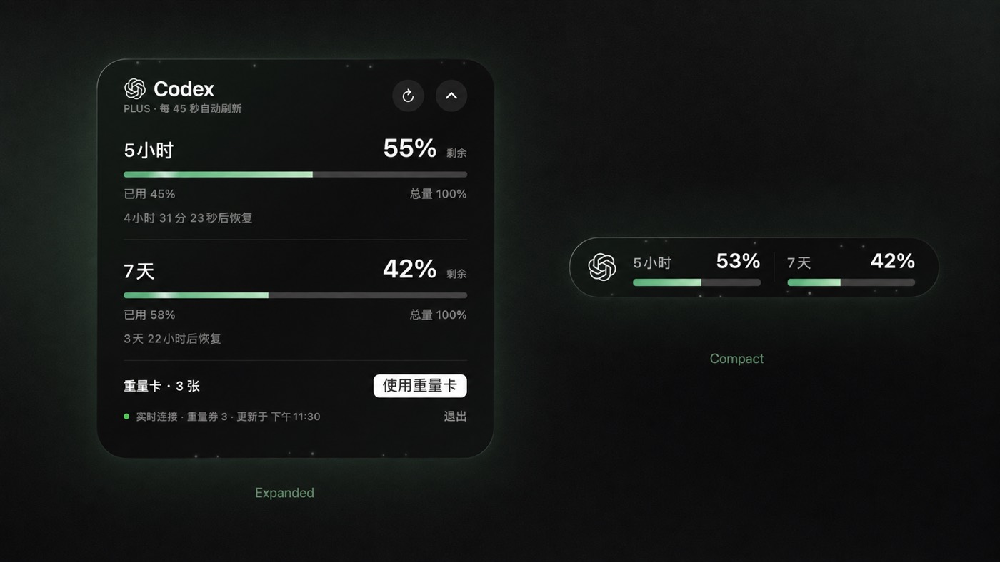

# Quota

**简洁、实时的 Codex 额度浮窗。**



A tiny floating nook for your Codex quota. macOS + Windows.

240 × 40 的桌面额度岛，完整底槽代表 100%，翡翠绿显示剩余，深灰显示已用。
点击展开、拖动移动，微粒和柔光让状态保持轻盈。

## 两个平台

| | macOS | Windows |
|---|---|---|
| 实现 | SwiftUI / AppKit 原生 | Python / PySide6 桌面窗口 |
| 系统 | macOS 14+ | Windows 10/11 x64 |
| 紧凑 / 展开、拖动 | 支持 | 支持 |
| 额度刷新 | 45 秒 + 服务通知 | 45 秒轮询 |
| 账号同步 | 登录文件元数据变化时重连 | 登录文件元数据变化时重连 |
| 跟随 Codex | 应用进程启动 / 退出 | 桌面进程启动 / 退出；托盘驻留 |
| 重置卡 | 确认、持久化幂等重试 | 确认、持久化幂等重试 |
| 验证状态 | 本机编译及假服务测试 | 数据与离屏界面测试；真实 Windows 桌面待验证 |

Windows 初版为预览版。CI 在两个系统构建并上传产物；构建成功不等同于真实账号、DPI 和多屏测试通过。

## 快速开始

先安装并登录 Codex。额度来自本地 `codex app-server`，无需另外提供 API Key。
该服务会通过 Codex 自身的登录状态向 OpenAI 请求额度。
关闭 Codex 的窗口不一定退出进程；灵动岛跟随的是进程。

### macOS

安装 Xcode Command Line Tools 后，在仓库根目录执行：

```sh
bash macos/build.sh
open dist/Quota.app
```

可将应用复制到 Applications，再在系统“登录项”添加 Quota。
当前构建为临时签名，未经过 Apple 公证。

### Windows

安装 Python 3.11+ 和 Codex CLI，确保已登录，然后：

```powershell
cd windows
python -m venv .venv
.venv\Scripts\python -m pip install -r requirements.txt
.venv\Scripts\python main.py
```

右键托盘图标可刷新、关闭动态效果或退出。没有 Codex 桌面应用、只使用 CLI 时：

```powershell
$env:QUOTANOOK_ALWAYS_SHOW = '1'
.venv\Scripts\python main.py
```

找不到 CLI 时，设置 `QUOTANOOK_CODEX` 为原生 `codex.exe` 的完整路径。
不接受 `.cmd` / `.bat` 包装器；npm 安装目录中的原生可执行文件会自动搜索。
用系统 Python 安装依赖后，运行 `windows/build.ps1` 可生成 `dist/Quota/Quota.exe`。
分发时保留整个目录，包括 Qt 库和许可证。可将 exe 的快捷方式放入 `shell:startup` 实现登录启动。

无账号效果预览：`python windows/main.py --demo`。

## 额度与重置卡

- 百分比是服务返回的窗口使用比例，不代表固定 Token 总数。
- 缺失数据不会冒充 0%；未返回重置卡数量时禁用按钮。
- 只有服务返回正数卡片且账号明确时，才允许确认使用。
- 超时后的请求复用原幂等键；不把不确定结果当成成功。
- 账号切换依赖本地 `auth.json` / `config.toml` 元数据；请让桌面端和 CLI 使用同一个 `CODEX_HOME`。仅在远端或系统钥匙串改变登录状态可能需要手动重启。
- 不同 Codex 版本和账号可能不支持重置卡接口。

## 开发与测试

```sh
python -m unittest discover -s windows/tests -v
bash macos/build.sh
dist/Quota.app/Contents/MacOS/CodexQuotaIsland --self-test
dist/Quota.app/Contents/MacOS/CodexQuotaIsland --transport-test
dist/Quota.app/Contents/MacOS/CodexQuotaIsland --layout-test
```

测试使用虚构数据和假服务，不消耗真实重置卡。UI 检查：安装 Windows 依赖后执行
`QT_QPA_PLATFORM=offscreen python windows/smoke.py`（PowerShell 中先设置同名环境变量）。

## 隐私与开源

项目没有遥测、广告或自己的后端，不读取、复制或上传登录令牌。
只观察登录文件元数据。重置请求键存在本机；Windows 使用账号标识哈希作为索引。
请勿在 Issue 上传登录文件、令牌、真实账号标识或未经检查的日志。

源代码采用 [MIT](LICENSE)。[第三方依赖说明](THIRD_PARTY_NOTICES.md)。
Quota 是独立社区项目，与 OpenAI 没有隶属或背书关系。公开版使用自己的 Q 标识。

协议依据：[Codex App Server](https://developers.openai.com/codex/app-server)。
Windows 打包参考：[Qt for Python / PyInstaller](https://doc.qt.io/qtforpython-6.10/deployment/deployment-pyinstaller.html)。
